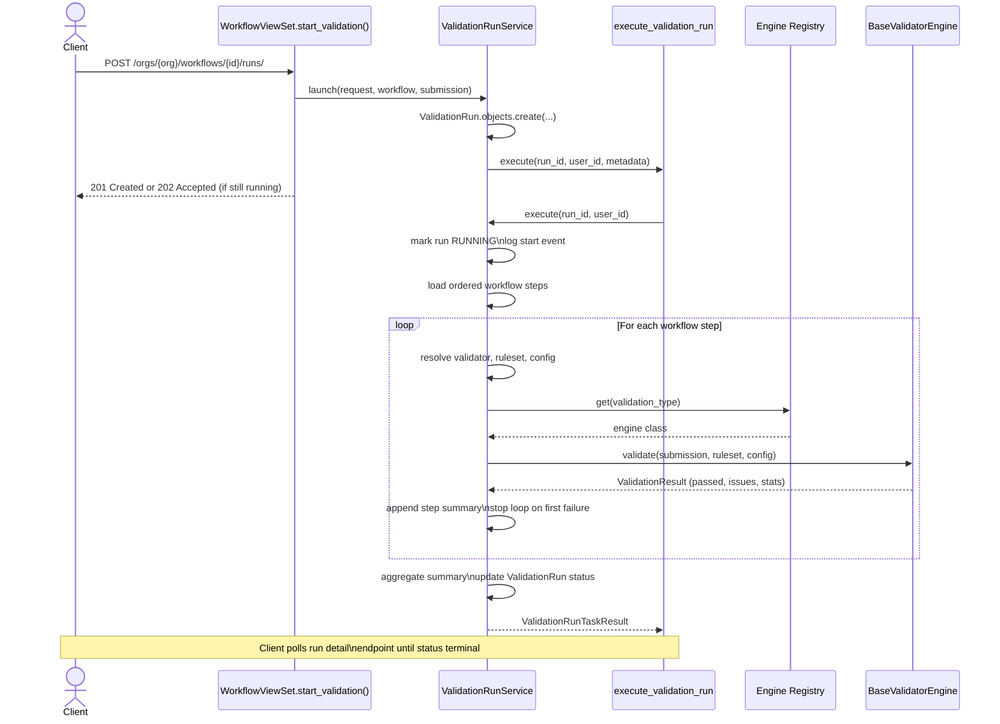

# How Validibot Works

This document provides a detailed technical walkthrough of how Validibot executes validation workflows, from initial API request to final results.

## System Overview

Validibot operates as an orchestration layer that coordinates validation engines to process submitted content according to predefined workflows. The system is designed around an asynchronous, event-driven architecture that can handle both quick validations and long-running processes.

```
┌─────────────────┐    ┌─────────────────┐    ┌─────────────────┐
│   Client API    │────│  Django Views   │────│    Services     │
│   Request       │    │   & ViewSets    │    │     Layer       │
└─────────────────┘    └─────────────────┘    └─────────────────┘
                                │                       │
                                ▼                       ▼
┌─────────────────┐    ┌─────────────────┐    ┌─────────────────┐
│   Data Models   │    │   Submissions   │    │ Worker / Jobs   │
│   (Workflows,   │◄───│   & Validation  │◄───│ (Cloud Run)     │
│   Runs, etc.)   │    │      Runs       │    │                 │
└─────────────────┘    └─────────────────┘    └─────────────────┘
                                                       │
                                                       ▼
                                              ┌─────────────────┐
                                              │   Validation    │
                                              │    Engines      │
                                              │   (JSON, XML,   │
                                              │    Custom)      │
                                              └─────────────────┘
```

## The Complete Validation Lifecycle

### Phase 1: Workflow Preparation

Before any validation can occur, workflows must be configured:

1. **Workflow Creation**: Administrators create workflows through the UI or API

   - Define workflow metadata (name, version, organization)
   - Configure validation steps in the desired order
   - Assign validators and rulesets to each step

2. **Validator Registration**: The system maintains a registry of available validation engines

   - Built-in validators (JSON Schema, XML Schema)
   - Custom validators specific to the organization
   - Each validator defines its capabilities and input requirements

3. **Ruleset Management**: Validation rules are managed separately from workflows
   - JSON Schema documents for structure validation
   - XML Schema (XSD) files for XML validation
   - Custom rule files for specialized validators
   - Rulesets can be versioned and shared across workflows

### Phase 2: Validation Initiation

When a client wants to validate content, they trigger the process through the API:

#### 2.1 Request Processing

```python
# Example API call to start validation (org-scoped per ADR-2026-01-06)
POST /api/v1/orgs/{org_slug}/workflows/{workflow_identifier}/runs/
Content-Type: application/json

{
  "name": "user-upload.json",
  "content": "{ \"user\": { \"name\": \"John\" } }"
}
```

The `workflow_identifier` can be either the workflow's slug (preferred) or its numeric database ID. See [ADR-2026-01-06](../../adr/completed/2026-01-06-org-scoped-routing-and-versioned-workflow-identifiers.md) for details on org-scoped API routing.

The system supports multiple submission modes:

- **Raw Body Mode**: Content sent directly in request body
- **JSON Envelope Mode**: Content wrapped in JSON with metadata
- **Multipart Mode**: File uploads with additional form data

#### 2.2 Submission Creation

The `WorkflowViewSet.start_validation()` method processes the request:

1. **Content Ingestion**: The system extracts and normalizes the submitted content

   - Determines content type (JSON, XML, plain text, etc.)
   - Calculates SHA256 checksum for deduplication
   - Validates content size and format

2. **Submission Persistence**: A `Submission` record is created

   - Links to the target workflow and organization
   - Stores content either inline (for small text) or as file reference
   - Captures metadata about the submission source

3. **Validation Run Creation**: A `ValidationRun` record is created to track execution
   - Links the submission to the specific workflow version
   - Initializes with PENDING status
   - Records the user who triggered the validation

#### 2.3 Execution Dispatch

The validation work now executes inline for simple validators or triggers a Cloud
Run Job (via the Cloud Run launcher) for heavier workloads. Celery is no longer
used. The API returns:

- **201 Created**: If validation completes quickly
- **202 Accepted**: If a Cloud Run Job was launched or execution is still running; clients poll for status

### Phase 3: Validation Execution

The `ValidationRunService.execute` method handles the actual validation work (either inline or coordinating Cloud Run Jobs):

#### 3.1 Execution Setup

1. **Run Initialization**: The task loads the ValidationRun and associated data

   - Validates the run is in PENDING state
   - Loads the workflow and its configured steps
   - Marks the run as RUNNING with start timestamp

2. **Step Sequencing**: The system executes workflow steps in order
   - Each step is processed sequentially (parallel execution is planned for future versions)
   - Step execution is isolated - failures in one step don't prevent others from running

#### 3.2 Individual Step Execution

For each workflow step, the `ValidationRunService.execute_workflow_step()` method:

1. **Validator Resolution**: Determines which validation engine to use

   ```python
   validator = step.validator  # References a Validator model
   ruleset = step.ruleset     # Optional ruleset for the validation
   ```

2. **Engine Dispatch**: The validation registry routes to the appropriate engine

   ```python
   engine_class = get_engine_for_validator(validator)
   engine = engine_class()
   result = engine.validate(submission, ruleset, config)
   ```

3. **Result Processing**: The engine returns a `ValidationResult` object
   - `passed`: Boolean indicating overall success
   - `issues`: List of ValidationIssue objects with details
   - `stats`: Optional performance and diagnostic information

#### How Findings Are Persisted

Every issue emitted by an engine becomes a `ValidationFinding` row. The model links to
both the `ValidationStepRun` that produced the issue and the parent `ValidationRun`.
The direct run foreign key is intentionally denormalized so dashboards and APIs can
aggregate findings by run or organization without an extra join through step runs.
To keep the duplication safe, the model copies the run from the step run during save
and raises a `ValidationError` if someone attempts to associate a finding with a
different run. This keeps the ORM focused on read performance while guaranteeing
relational integrity. After the run completes we roll these rows up into the
`ValidationRunSummary`/`ValidationStepRunSummary` tables so long-term reporting
remains possible even if old findings are purged.

##### What happens inside `execute_workflow_step()`

The high‑level summary above hides a few practical details that are worth knowing when you add or debug workflow steps:

1. **Step metadata is pulled from the database** – the `WorkflowStep` instance supplies the linked `Validator`, optional `Ruleset`, and the JSON `config` column. For AI steps the config contains keys such as `template`, `selectors`, `policy_rules`, `mode`, and `cost_cap_cents`.
1. **Action steps resolve concrete models** – when `workflow_step.action` is set we now downcast to a subtype such as `SlackMessageAction` or `SignedCertificateAction`. These variants expose strongly typed fields (message text, certificate template, etc.), and fall back to sensible defaults like the bundled signed-certificate template, so execution code and admin tools never have to parse ad hoc JSON blobs.
2. **Submission content is materialised once** – the active `Submission` is hydrated from the `ValidationRun` so every engine works with the same snapshot of data. Engines call `submission.get_content()` which returns inline text or reads the stored file.
3. **Validator config is merged before dispatch** – we pass the per-step config directly to the engine (`engine.validate(..., config=step_config)`), allowing engines to interpret selectors, thresholds, or policy definitions without reaching back into the ORM. Engines that do not use runtime configuration can safely ignore unknown keys.
4. **Execution is wrapped by the service layer** – any exception raised by the engine bubbles up to `execute_workflow_step()`. The caller (`execute()`) catches the error, marks the run as `FAILED`, and records the traceback so the run stops in a predictable manner.
5. **Lightweight telemetry is recorded** – we count the number of issues returned, tag the log entry with the step id and validator type, and attach any `stats` payload to the validation summary. This keeps runs observable without persisting per-step rows yet.

This design keeps the step executor intentionally thin: the step definition owns the configuration, the engine owns domain logic, and the service coordinates orchestration and error handling. When we later persist per-step timings or metering information, the hooks already exist in this execution flow.

> **Authoring walkthrough:** see [How to Author Workflow Steps](../how-to/author-workflow-steps.md) for the complete UI flow.

#### 3.3 Engine Implementation

Each validation engine implements the `BaseValidatorEngine` interface:

```python
class JsonSchemaEngine(BaseValidatorEngine):
    def validate(self, submission, ruleset=None, config=None):
        # Load JSON Schema from ruleset
        schema = load_schema(ruleset)

        # Parse submission content as JSON
        data = json.loads(submission.get_content())

        # Run JSON Schema validation
        validator = jsonschema.Draft7Validator(schema)
        errors = list(validator.iter_errors(data))

        # Convert to Validibot format
        issues = [
            ValidationIssue(
                path=error.absolute_path,
                message=error.message,
                severity=Severity.ERROR
            )
            for error in errors
        ]

        return ValidationResult(
            passed=len(issues) == 0,
            issues=issues
        )
```

### Sequence Diagram: Basic Validation Run



### Phase 4: Result Aggregation

After all workflow steps complete we capture both the detailed findings and a durable summary:

#### 4.1 Summary Generation

Each `ValidationIssue` emitted by an engine becomes a `ValidationFinding` row tied to the current `ValidationStepRun` and `ValidationRun`. Once all steps finish we aggregate those rows into two lightweight tables:

```python
summary_record, _ = ValidationRunSummary.objects.update_or_create(
    run=validation_run,
    defaults={
        "status": validation_run.status,
        "completed_at": validation_run.ended_at,
        "total_findings": total_findings,
        "error_count": severity_totals.get(Severity.ERROR, 0),
        "warning_count": severity_totals.get(Severity.WARNING, 0),
        "info_count": severity_totals.get(Severity.INFO, 0),
        "assertion_failure_count": total_assertion_failures,
        "assertion_total_count": total_assertions_evaluated,
    },
)

ValidationStepRunSummary.objects.bulk_create(
    ValidationStepRunSummary(
        summary=summary_record,
        step_run=step_run,
        step_name=step_run.workflow_step.name,
        step_order=step_run.step_order,
        status=step_run.status,
        error_count=severity_counts.get(Severity.ERROR, 0),
        warning_count=severity_counts.get(Severity.WARNING, 0),
        info_count=severity_counts.get(Severity.INFO, 0),
    )
    for step_run, severity_counts in per_step_metrics
)
```

These summary tables keep severity totals, assertion hit rates, and per-step health available even after old `ValidationFinding` rows are purged for retention.

#### 4.2 Run Status Updates

The ValidationRun is updated with final results:

- **Status**: One of `PENDING`, `RUNNING`, `SUCCEEDED`, `FAILED`, `CANCELED`, `TIMED_OUT`
- **State**: A simplified lifecycle state (`PENDING`, `RUNNING`, `COMPLETED`) derived from Status
- **Result**: A stable automation-friendly conclusion (`PASS`, `FAIL`, `ERROR`, `CANCELED`, `TIMED_OUT`, `UNKNOWN`) derived from Status, findings, and `error_category`
- **End Timestamp**: When execution completed
- **Duration**: Total execution time in milliseconds
- **Summary Record**: One-to-one link to `ValidationRunSummary` (accessed via `run.summary_record`)
- **Error**: Empty string for success, error message for terminal failures

#### 4.3 Artifact Storage

Any files generated during validation are stored as Artifact records:

- Validation reports in various formats
- Transformed or processed versions of input data
- Debug logs from validation engines
- Performance profiling data

### Phase 5: Result Delivery

#### 5.1 Synchronous Response (Quick Validations)

If validation completes within the timeout window, the API returns immediately:

```json
{
  "id": "2dd379f6-2425-4bae-8c23-61ed05ff1ebf",
  "status": "SUCCEEDED",
  "state": "COMPLETED",
  "result": "PASS",
  "workflow": {
    "id": 42,
    "name": "JSON Product Validation",
    "version": "1.0"
  },
  "submission": {
    "name": "product.json",
    "checksum_sha256": "abc123..."
  },
  "steps": [
    {
      "step_id": 1,
      "name": "Schema Validation",
      "status": "PASSED",
      "issues": []
    }
  ],
  "started_at": "2023-10-05T14:30:00Z",
  "ended_at": "2023-10-05T14:30:02Z",
  "duration_ms": 2000
}
```

#### 5.2 Asynchronous Response (Long-running Validations)

For longer validations, the client receives a polling URL:

```json
{
  "id": "2dd379f6-2425-4bae-8c23-61ed05ff1ebf",
  "status": "RUNNING",
  "state": "RUNNING",
  "result": "UNKNOWN",
  "poll_url": "/api/v1/orgs/{org_slug}/runs/2dd379f6-2425-4bae-8c23-61ed05ff1ebf/",
  "started_at": "2023-10-05T14:30:00Z"
}
```

Clients can poll this URL to check status and retrieve results when complete.

## Advanced Features

### Content Type Detection

The system automatically detects content types using multiple strategies:

1. **HTTP Headers**: `Content-Type` header from the request
2. **File Extensions**: For uploaded files, extension-based detection
3. **Content Sniffing**: Analyzing content structure for JSON, XML, CSV, etc.
4. **Magic Bytes**: Binary file type detection for non-text formats

#### Submission File Types

Deterministic MIME headers are not enough for authoring decisions, so we classify every submission into a small set of logical **SubmissionFileType** values (JSON, XML, TEXT, YAML, BINARY, etc.). Those values power three complementary contracts:

- **Workflows** store an `allowed_file_types` array. Authors decide whether a workflow accepts a single format or multiple formats (for example, an EnergyPlus workflow can allow both TEXT/IDF and JSON/epJSON inputs). The workflow builder surfaces only validators that intersect with the selected file types.
- **Validators** declare `supported_file_types`. System validators receive defaults (JSON Schema → JSON, XML Schema → XML, EnergyPlus → TEXT + JSON, and so on) and custom validators must be explicit.
- **Launch-time enforcement** verifies that the selected payload type is included in the workflow allow-list and that every validator in the run can process it. When something doesn’t align, the UI form surfaces a validation error and the API returns `FILE_TYPE_UNSUPPORTED` along with the offending step name.

Incoming requests still provide concrete MIME types (`Content-Type` headers, multipart metadata, etc.) so storage helpers can pick safe extensions. After we ingest the payload we re-run lightweight detection; if the actual content clearly differs from the transport hint, we update the stored `SubmissionFileType` so downstream automation, reporting, and billing all see the canonical format.

### Error Handling and Recovery

The system implements robust error handling:

- **Graceful Degradation**: Individual step failures don't crash the entire run
- **Timeout Management**: Long-running validations are killed after configurable timeouts
- **Retry Logic**: Transient failures trigger automatic retries with exponential backoff
- **Circuit Breakers**: Repeated failures temporarily disable problematic validators

### Performance Optimization

Several optimizations ensure good performance:

- **Content Deduplication**: Identical submissions (by SHA256) reuse previous results
- **Lazy Loading**: Large files are streamed rather than loaded entirely into memory
- **Connection Pooling**: Database connections are pooled for efficiency
- **Result Caching**: Validation results are cached for repeated access

### Security and Access Control

Security is enforced at multiple levels:

- **Authentication**: All API endpoints require valid authentication
- **Organization Isolation**: Users can only access resources within their organizations
- **Role-Based Access**: Different roles have different permissions (viewer, executor, admin)
- **Content Validation**: Uploaded content is scanned for malicious patterns
- **Audit Logging**: All actions are logged for security auditing

## Monitoring and Observability

### Application Metrics

The system exposes rich metrics for monitoring:

- **Validation Throughput**: Runs per minute/hour/day
- **Success Rates**: Percentage of validations that pass/fail
- **Performance Metrics**: Average validation time by workflow and step
- **Error Rates**: Frequency of different types of validation failures
- **Resource Usage**: CPU, memory, and storage consumption

### Event Streaming

Key events are published for external consumption:

```python
# Events published during validation lifecycle
AppEventType.VALIDATION_RUN_CREATED
AppEventType.VALIDATION_RUN_STARTED
AppEventType.VALIDATION_RUN_SUCCEEDED
AppEventType.VALIDATION_RUN_FAILED
AppEventType.VALIDATION_RUN_STEP_STARTED
AppEventType.VALIDATION_RUN_STEP_PASSED
AppEventType.VALIDATION_RUN_STEP_FAILED
```

These events enable integration with monitoring systems, alerting platforms, and analytics tools.

### Debugging Support

When validations fail, the system provides rich debugging information:

- **Step-by-step Execution Logs**: Detailed logs from each validation step
- **Content Snapshots**: Preserved copies of submitted content for reproduction
- **Configuration Snapshots**: The exact configuration used for the validation
- **Timing Information**: Performance profiling to identify bottlenecks
- **Stack Traces**: Full error details when validators throw exceptions

## Future Enhancements

Several enhancements are planned for future versions:

### Parallel Step Execution

Currently, workflow steps execute sequentially. Future versions will support:

- Parallel execution of independent steps
- Dependency graphs to control execution order
- Resource allocation and scheduling optimization

### Advanced Workflow Features

- **Conditional Steps**: Execute steps based on previous results
- **Dynamic Workflows**: Generate workflow steps programmatically
- **Workflow Templates**: Reusable workflow patterns
- **Step Libraries**: Shared marketplace of validation steps

### Enhanced Reporting

- **Real-time Dashboards**: Live updating validation metrics
- **Trend Analysis**: Historical analysis of validation patterns
- **Custom Reports**: User-defined reports and visualizations
- **Export Capabilities**: Export results in multiple formats

### Integration Enhancements

- **Webhook Improvements**: Rich webhook payloads with filtering
- **GraphQL API**: Alternative API interface for complex queries
- **CLI Tools**: Command-line interface for automation
- **IDE Plugins**: Integration with development environments

This architecture provides a solid foundation for scalable, reliable data validation while remaining flexible enough to adapt to evolving requirements.
