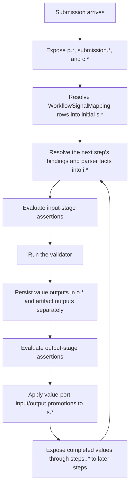

# Workflow Data Architecture

Workflow data in Validibot is divided by **scope**, **ownership**,
**provenance**, and **lifecycle**. The namespace prefixes used in assertions
are the visible expression of that architecture; they are not interchangeable
aliases for one global data dictionary.

The governing rule is:

> A workflow contains many kinds of data, but only an author-named CEL/JSON
> value in `s.*` is a workflow signal.

This page gives the architectural overview. For model fields, constraints,
resolution algorithms, and implementation details, see
[Workflow Signals and Step I/O Reference](../data-model/signals.md). For a
concrete end-to-end model, see the
[Step I/O Tutorial](../data-model/signals-tutorial-example.md).

## The function model

Treat each validator step as a function:

```text
step(inputs) -> outputs
```

- `i.*` contains the current function's value inputs.
- `o.*` contains the current function's value outputs.
- `steps.<key>.input.*` and `steps.<key>.output.*` expose a completed step's
  recorded values with provenance intact.
- `s.*` contains the workflow author's shared domain vocabulary.
- `p.*` contains the raw submitted payload.
- `submission.*` contains the submission envelope and server-stamped facts.
- `c.*` contains fixed literals from the versioned workflow contract.

This separation tells an assertion reader where a value came from, who named
it, when it exists, and whether its name is tied to a particular validator.

## Namespace responsibilities

| Namespace | Concern | Owner | Availability |
|---|---|---|---|
| `p.*` / `payload.*` | Raw submitted content | Submitter | Whole run when the payload is traversable |
| `submission.*` | Metadata and server facts beside the payload | Submitter and platform, by field | Whole run |
| `c.*` / `const.*` | Fixed workflow literals | Workflow author | Whole run |
| `s.*` / `signal.*` | Author-named workflow values | Workflow author | Mapped values from run start; promoted values downstream after their stage completes |
| `i.*` / `input.*` | Current step's resolved value inputs | Step contract and bindings | Input and output stages of that step |
| `o.*` / `output.*` | Current step's produced value outputs | Validator or step contract | Output stage of that step |
| `steps.<key>.input.*` / `steps.<key>.output.*` | Recorded values from an earlier step | Runtime, qualified by step | Downstream after the referenced stage completes |
| `row.*` | Current row in a Tabular row rule | Tabular validator | Only inside that row-evaluation lane |

The long and short forms are equivalent where both exist. `submission`,
`steps`, and `row` deliberately have no single-letter aliases.

## The two planes: values and artifacts

A step contract can carry two fundamentally different media.

### Value ports

Value ports carry CEL/JSON-compatible values: null, booleans, numbers,
strings, arrays, and objects. They can be placed in `i.*` or `o.*`, persisted
on a `ValidationStepRun`, referenced through `steps.*`, evaluated by CEL, and
explicitly promoted into `s.*`.

### Artifact ports

Artifact ports carry files or file-like results. They participate in binding,
storage authorization, hashes, retention, evidence, and lineage. They do not
become scalar CEL values merely because they are inputs or outputs.

An artifact itself can never be a workflow signal. A validator may expose
small facts *about* an artifact as value outputs—such as `o.has_sql_output`,
`o.row_count`, or `o.file_format`—and those values may be promoted.

## Contract, wiring, vocabulary, and runtime values

Four layers work together.

### `StepIODefinition`: the port contract

A `StepIODefinition` declares one input or output port owned by either a
validator or a workflow step. It records the stable contract key, direction,
medium, data type, provider-native name, extraction behavior, display metadata,
and ownership.

The row is a schema declaration, not a runtime value and not a signal.

### `StepInputBinding`: the workflow wiring

A `StepInputBinding` connects an input definition on a particular workflow
step to its source. Depending on the port, that source can be raw payload data,
submission metadata, a workflow signal or constant, an upstream step value or
artifact, a workflow resource, a system value, or a default.

The definition says that a function has a parameter. The binding supplies the
argument at this call site.

### `WorkflowSignalMapping`: initial workflow vocabulary

A `WorkflowSignalMapping` gives an author-selected name to a CEL/JSON value
resolved from run data before step execution starts. Assertions then use the
stable domain name rather than repeating a structural payload path.

```text
p.project.compliance.targets.max_eui
                    |
                    v
              s.target_eui
```

### Promotion: vocabulary added during execution

Promotion gives an existing value-port input or output an additional
workflow-level name:

```text
steps.simulation.output.site_eui_kwh_m2
                    |
                    v
              s.actual_eui
```

The original step-local identity remains. Promotion does not copy an artifact,
erase provenance, or retroactively make the value available to earlier steps.

## Direct references versus signals

These two expressions can identify the same runtime value but communicate
different architectural intent:

```cel
steps.energyplus.output.site_eui_kwh_m2
s.actual_eui
```

The first preserves implementation provenance: it says which step produced
the value and under which contract key. It is appropriate for a one-off
dependency on that specific step.

The second expresses workflow semantics: it says what the value means to the
workflow. It is appropriate when multiple assertions or steps share a business
concept, or when the producing implementation may later be replaced.

Signals are therefore semantic indirection, not the default transport for all
cross-step data.

## Execution lifecycle



Initial signal mappings are available from the beginning of the run. Promoted
signals are temporal: an input promotion exists after input resolution, and an
output promotion exists after output extraction. Both are available only to
the relevant stage and downstream execution.

## Assertion stages

An input-stage assertion can use:

- `p.*`, `submission.*`, and `c.*`;
- initial and previously promoted `s.*` values;
- the current step's `i.*` values;
- completed earlier-step values through `steps.*`.

It cannot use the current step's `o.*`, because those values do not exist yet.

An output-stage assertion can additionally use the current step's `o.*` while
retaining access to `i.*`. The authoring forms enforce this distinction rather
than allowing a reference that will always resolve too early.

## Authoring and product language

The UI should expose the same distinctions as the architecture:

- **Signals** appears on the workflow-level mapping surface and in
  **Copy to Signal** promotion controls.
- **Inputs and Outputs** describes validator and step contracts.
- **Bindings** describes how a step receives its inputs.
- **Step outputs** or a domain label such as **Simulation metrics** describes
  produced values in results.
- **Artifacts** describes files, reports, transformed documents, logs, and
  their lineage.

Avoid “validator signals”, “input signals”, “output signals”, or “artifact
signals”. Those phrases obscure whether the subject is a port, a runtime value,
an author-defined alias, or a file.

## Architectural invariants

The implementation and its tests should preserve these rules:

1. A `StepIODefinition` is never itself a signal.
2. Only CEL/JSON value ports can be promoted into `s.*`.
3. Artifact ports remain in the artifact binding and lineage plane.
4. `i.*` and `o.*` are local to the current step.
5. `steps.*` preserves producer provenance and is downstream-only.
6. A mapped signal is available from run start; a promoted signal is available
   only after its source stage completes.
7. Constants are fixed workflow literals, not signals.
8. Submission metadata is not silently merged into the raw payload.
9. Namespace names in persisted/imported contracts are versioned API surface.

## Choosing the right mechanism

When adding data to a workflow, ask these questions in order:

1. Is it the raw submitted document? Use `p.*`.
2. Is it metadata about the submission? Use `submission.*`.
3. Is it a fixed authoring-time literal? Use `c.*`.
4. Is it a parameter or return value of one step? Declare step I/O.
5. Does one downstream consumer need a specific earlier step value? Use
   `steps.<key>.*` or an explicit binding.
6. Is it shared domain vocabulary that should survive implementation changes?
   Map or promote a workflow signal.
7. Is it a file or file-like result? Use an artifact port and binding.

## Key implementation surfaces

- `validibot/validations/models.py` — `StepIODefinition`,
  `StepInputBinding`, `WorkflowStepIOPromotion`, and step-run value storage
- `validibot/workflows/models.py` — `WorkflowSignalMapping`, constants, and
  workflow-step identity
- `validibot/validations/services/run_context.py` — canonical runtime context
- `validibot/validations/services/signal_resolution.py` — initial signal
  mapping resolution
- `validibot/validations/services/path_resolution.py` — step input resolution
- `validibot/validations/validators/base/base.py` — CEL namespace construction
- `validibot/validations/services/evidence.py` — artifact production and input
  lineage

## Related documentation

- [Terminology](terminology.md) — canonical vocabulary
- [Workflow Signals and Step I/O Reference](../data-model/signals.md) — model,
  constraint, and runtime details
- [Step I/O Tutorial](../data-model/signals-tutorial-example.md) — worked model
  and execution example
- [Workflow Engine](workflow_engine.md) — orchestration and execution order
- [Step Processor](step_processor.md) — per-step processing lifecycle
- [Assertions](../data-model/assertions.md) — stage-aware authoring and
  evaluation
- [Results](../data-model/results.md) — findings, values, artifacts, and
  summaries
