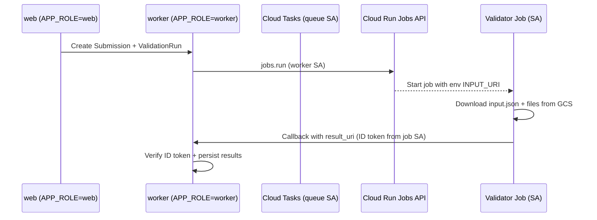

# Cloud Run Validator Jobs (web/worker split)

We deploy one Django image as two Cloud Run services:

- **validibot-web** (`APP_ROLE=web`): Public UI + public API.
- **validibot-worker** (`APP_ROLE=worker`): Private/IAM-only internal API (callbacks).

Validator jobs (EnergyPlus, FMI, etc.) run as Cloud Run Jobs and call back to the worker service using Google-signed ID tokens (audience = callback URL). No shared secrets.

## Flow overview



IAM roles involved:
- **Worker service account**: `roles/run.invoker` on the validator job so the worker can call the Jobs API directly.
- **Validator job service account**: `roles/run.invoker` on `validibot-worker` for callbacks; storage roles for its GCS paths.
- **Worker**: private, only allows authenticated calls; rejects callbacks on web.

Why env + GCS pointer: Cloud Run Jobs only accept per-run overrides via env/command; we keep large envelopes in GCS and pass a small `INPUT_URI` env so the request stays small and the job can fetch full inputs at runtime.

Status tracking: We record the Cloud Run execution name and a `job_status` using `CloudRunJobStatus` (PENDING/RUNNING/SUCCEEDED/FAILED/CANCELLED) in launch stats for observability and fallback polling; run/step lifecycle still uses `ValidationRunStatus`/`StepStatus`.

## Why we use a callback_id in addition to run_id

Cloud Run retries callbacks if delivery fails. The run ID tells us which resource to update, but it does not distinguish one delivery attempt from another. Without a per-callback token we would reapply findings and status every time the platform retries, or we would have to drop all later callbacks for that run.

The launcher generates a unique `callback_id` for each job execution and puts it into the input envelope. The validator echoes it back in the callback. The worker uses that ID to fence retries: the first delivery creates a receipt; any repeat with the same `callback_id` returns immediately as a replay. This lets us ignore duplicate deliveries while still accepting legitimate future callbacks for the same run (for example, another step or a rerun).

## Deployment steps

1) Build/push Django image (same for web/worker)
2) Deploy web:
   - `--allow-unauthenticated`
   - `--set-env-vars APP_ROLE=web`
3) Deploy worker:
   - `--no-allow-unauthenticated`
   - `--set-env-vars APP_ROLE=worker`
   - Grant `roles/run.invoker` on `validibot-worker` to each validator job service account

4) Validator jobs:
   - Tag with labels: `validator=<name>,version=<git_sha>`
   - Env: `VALIDATOR_VERSION=<git_sha>`
   - Callback client mints an ID token via metadata server; Django callback view 404s on non-worker.

## Multi-Environment Architecture

Validator containers are **stage-agnostic**: the same container image is deployed to dev, staging, and prod. All stage-specific configuration is passed at runtime, not build time.

### What's baked into the container (build time)

Nothing stage-specific. The container includes:

- EnergyPlus binary (or FMU runtime for FMI)
- Python dependencies
- Validator code

### What's passed at runtime (job execution)

When Django creates a Cloud Tasks job to run a validator, it passes:

| Source | Data | Example |
|--------|------|---------|
| `INPUT_URI` env var | GCS path to input envelope | `gs://validibot-files-dev/org123/run456/input.json` |
| Input envelope | `context.callback_url` | `https://validibot-worker-dev-xxx.run.app/api/v1/validator-callback/` |
| Input envelope | `context.execution_bundle_uri` | `gs://validibot-files-dev/org123/run456/` |
| Input envelope | Input file URIs (IDF, EPW, etc.) | `gs://validibot-files-dev/org123/run456/model.idf` |

The validator reads the input envelope, downloads files from the provided GCS URIs, runs the simulation, uploads outputs to the execution bundle URI, and POSTs results to the callback URL.

### Stage isolation

Stage isolation is enforced by:

1. **Django** creates envelopes with stage-appropriate bucket names and callback URLs
2. **Service accounts** - each stage's validator job uses a stage-specific SA that only has access to its own buckets
3. **GCS bucket permissions** - `validibot-cloudrun-dev` can only access `validibot-files-dev`, not prod buckets

### Deploy-time environment variables

The only env vars set at deploy time are for observability:

```bash
VALIDATOR_VERSION=<git_sha>   # For version tracking in logs
VALIDIBOT_STAGE=dev           # For log filtering (doesn't affect behavior)
```

These don't affect which buckets or URLs are used - that's all driven by the input envelope.

### Implications

- **One build, deploy everywhere**: Build once with `just validator-build energyplus`, then deploy to any stage
- **No secrets in containers**: Validators use ADC (Application Default Credentials) from the attached service account
- **Safe rollbacks**: Rolling back a validator version doesn't affect stage isolation

## Local vs cloud storage

- Cloud: GCS URIs for envelopes/artifacts.
- Local dev/test: file system paths under `MEDIA_ROOT` (no GCS required).

## Error handling

- Containers log all errors; fatal errors are optionally sent to Sentry if configured.
- User-facing messages stay minimal; detailed context stays in logs/Sentry.
- To inspect logs: open Cloud Logging and filter on `resource.type="cloud_run_job"` and
  `resource.labels.job_name` matching the validator. Fatal errors will include stack traces.
  If Sentry DSN is present in the container, `report_fatal` will forward the exception there.
  (Sentry bootstrap for validator containers is planned; for now, errors always land in Cloud Logging.)
