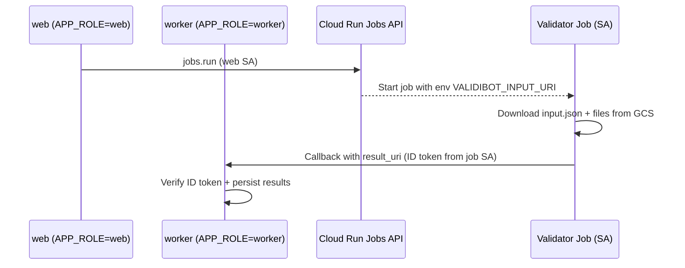
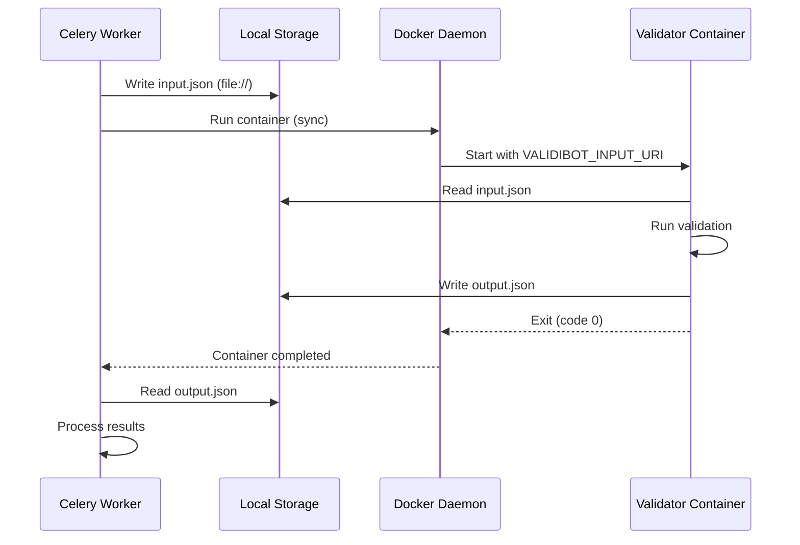

# Validator Containers (Advanced Validators)

Validator containers run advanced validations like EnergyPlus simulations and FMU execution. They support two deployment modes:

1. **GCP Cloud Run Jobs** (production): Async execution with GCS storage and callbacks
2. **Docker Compose** (Docker): Sync execution with local filesystem storage

## GCP Mode: Cloud Run Jobs (web/worker split)

We deploy one Django image as two Cloud Run services:

- **validibot-web** (`APP_ROLE=web`): Public UI + public API.
- **validibot-worker** (`APP_ROLE=worker`): Private/IAM-only internal API (callbacks).

Validator jobs (EnergyPlus, FMI, etc.) run as Cloud Run Jobs and call back to the worker service using Google-signed ID tokens (audience = callback URL). No shared secrets.

In environments with a custom public domain (production), `SITE_URL` points at the public domain (for example `https://validibot.com`) while `WORKER_URL` points at the worker service `*.run.app` URL. Callbacks and scheduled tasks should always target `WORKER_URL`, never `SITE_URL`.

## Flow overview



IAM roles involved:
- **Web/Worker service account**: Custom `validibot_job_runner` role on the validator job so Django can call the Jobs API with overrides (for `VALIDIBOT_INPUT_URI` env var). This role includes `run.jobs.run` and `run.jobs.runWithOverrides` permissions.
- **Validator job service account**: `roles/run.invoker` on `validibot-worker` for callbacks; storage roles for its GCS paths.
- **Worker**: private, only allows authenticated calls; rejects callbacks on web.

### Custom IAM Role

The standard `roles/run.invoker` role only includes `run.jobs.run`, but triggering jobs with environment variable overrides (like `VALIDIBOT_INPUT_URI`) requires `run.jobs.runWithOverrides`. We use a project-level custom role:

```bash
# Role: projects/project-a509c806-3e21-4fbc-b19/roles/validibot_job_runner
# Permissions: run.jobs.run, run.jobs.runWithOverrides
```

This role is automatically granted by the `just validator-deploy` command.

Why env + GCS pointer: Cloud Run Jobs only accept per-run overrides via env/command; we keep large envelopes in GCS and pass a small `VALIDIBOT_INPUT_URI` env so the request stays small and the job can fetch full inputs at runtime.

Status tracking: We record the Cloud Run execution name and a `job_status` using `CloudRunJobStatus` (PENDING/RUNNING/SUCCEEDED/FAILED/CANCELLED) in launch stats for observability and fallback polling; run/step lifecycle still uses `ValidationRunStatus`/`StepStatus`.

## Why we use a callback_id in addition to run_id

Cloud Run retries callbacks if delivery fails. The run ID tells us which resource to update, but it does not distinguish one delivery attempt from another. Without a per-callback token we would reapply findings and status every time the platform retries, or we would have to drop all later callbacks for that run.

The launcher generates a unique `callback_id` for each job execution and puts it into the input envelope. The validator echoes it back in the callback. The worker uses that ID to fence retries: the first delivery creates a receipt; any repeat with the same `callback_id` returns immediately as a replay. This lets us ignore duplicate deliveries while still accepting legitimate future callbacks for the same run (for example, another step or a rerun).

## Deployment steps

1) Build/push Django image (same for web/worker)
2) Deploy web:
   - `--allow-unauthenticated`
   - `--set-env-vars APP_ROLE=web`
3) Deploy worker:
   - `--no-allow-unauthenticated`
   - `--set-env-vars APP_ROLE=worker`
   - Set `WORKER_URL` in the stage env file to the worker service URL (see below)
   - Grant `roles/run.invoker` on `validibot-worker` to each validator job service account

4) Validator jobs:
   - Tag with labels: `validator=<name>,version=<git_sha>`
   - Env: `VALIDATOR_VERSION=<git_sha>`
   - Callback client mints an ID token via metadata server; Django callback view 404s on non-worker.

To populate `WORKER_URL` for a stage, fetch the worker service URL and add it to the stage env file:

```bash
# prod example
gcloud run services describe validibot-worker \
  --region australia-southeast1 \
  --project project-a509c806-3e21-4fbc-b19 \
  --format='value(status.url)'
```

Then update your env file (`.envs/.production/.google-cloud/.django`), run `just gcp secrets prod`, and redeploy.

## Deploying Validator Jobs

Validator containers can be deployed using either justfile. Both are equivalent and kept in sync:

| Location | Command | Notes |
|----------|---------|-------|
| `validibot/` | `just validator-deploy energyplus dev` | Uses symlink to `validibot_validators_dev/` |
| `validibot_validators/` | `just deploy energyplus dev` | Native repo, shorter command |

### Quick deploy

```bash
# From validibot_validators directory
just deploy energyplus dev      # Deploy EnergyPlus to dev
just deploy fmi prod            # Deploy FMI to prod
just deploy-all dev             # Deploy all validators to dev

# From validibot directory
just validator-deploy energyplus dev
just validators-deploy-all dev
```

### What the deploy command does

1. **Builds** the container image with `linux/amd64` platform (required by Cloud Run)
2. **Pushes** to Artifact Registry at `australia-southeast1-docker.pkg.dev/project-xxx/validibot/`
3. **Deploys** the Cloud Run Job with:
   - Stage-appropriate job name (`validibot-validator-energyplus-dev` for dev, `validibot-validator-energyplus` for prod)
   - Stage-appropriate service account (`validibot-cloudrun-dev@...` for dev)
   - Memory (4Gi), CPU (2), timeout (1 hour), no retries
   - Labels for tracking (`validator=energyplus,stage=dev,version=abc123`)
4. **Grants IAM permission** - adds custom `validibot_job_runner` role so the web/worker service can trigger the job with env overrides

### Viewing logs and job status

```bash
# From validibot_validators directory
just list-jobs                      # List all validator jobs
just describe-job energyplus dev    # Show job details
just logs energyplus dev            # View recent logs

# From validibot directory (equivalent)
gcloud run jobs list --filter "name~validibot-validator" --region australia-southeast1
```

### Deleting a validator job

```bash
just delete-job energyplus dev
```

## Multi-Environment Architecture

Validator containers are **stage-agnostic**: the same container image is deployed to dev, staging, and prod. All stage-specific configuration is passed at runtime, not build time.

### What's baked into the container (build time)

Nothing stage-specific. The container includes:

- EnergyPlus binary (or FMU runtime for FMI)
- Python dependencies
- Validator code

### What's passed at runtime (job execution)

When Django triggers a validator Cloud Run Job execution, it passes:

| Source | Data | Example |
|--------|------|---------|
| `VALIDIBOT_INPUT_URI` env var | GCS path to input envelope | `gs://validibot-files-dev/org123/run456/input.json` |
| Input envelope | `context.callback_url` | `https://validibot-worker-dev-xxx.run.app/api/v1/validation-callbacks/` |
| Input envelope | `context.execution_bundle_uri` | `gs://validibot-files-dev/org123/run456/` |
| Input envelope | Input file URIs (IDF, EPW, etc.) | `gs://validibot-files-dev/org123/run456/model.idf` |

The validator reads the input envelope, downloads files from the provided GCS URIs, runs the simulation, uploads outputs to the execution bundle URI, and POSTs results to the callback URL.

### Stage isolation

Stage isolation is enforced by:

1. **Django** creates envelopes with stage-appropriate bucket names and callback URLs
2. **Service accounts** - each stage's validator job uses a stage-specific SA that only has access to its own buckets
3. **GCS bucket permissions** - `validibot-cloudrun-dev` can only access `validibot-files-dev`, not prod buckets

### Deploy-time environment variables

The only env vars set at deploy time are for observability:

```bash
VALIDATOR_VERSION=<git_sha>   # For version tracking in logs
VALIDIBOT_STAGE=dev           # For log filtering (doesn't affect behavior)
```

These don't affect which buckets or URLs are used - that's all driven by the input envelope.

### Implications

- **One build, deploy everywhere**: Build once with `just validator-build energyplus`, then deploy to any stage
- **No secrets in containers**: Validators use ADC (Application Default Credentials) from the attached service account
- **Safe rollbacks**: Rolling back a validator version doesn't affect stage isolation

## Local vs cloud storage

- Cloud: GCS URIs for envelopes/artifacts.
- Local dev/test: file system paths under `MEDIA_ROOT` (no GCS required).

## Error handling

- Containers log all errors; fatal errors are optionally sent to Sentry if configured.
- User-facing messages stay minimal; detailed context stays in logs/Sentry.
- To inspect logs: open Cloud Logging and filter on `resource.type="cloud_run_job"` and
  `resource.labels.job_name` matching the validator. Fatal errors will include stack traces.
  If Sentry DSN is present in the container, `report_fatal` will forward the exception there.
  (Sentry bootstrap for validator containers is planned; for now, errors always land in Cloud Logging.)

## Docker Compose Mode: Docker Runner

For Docker Compose deployments (single-server, VPS, on-premise), validators run as Docker containers executed synchronously by the Celery worker.

### How it works



Key differences from GCP mode:
- **Synchronous execution**: Worker blocks until container exits
- **Local filesystem**: Uses `file://` URIs instead of `gs://`
- **No callbacks**: Results are read directly from storage after container exits
- **Docker socket**: Worker needs access to `/var/run/docker.sock`

### Configuration

Configure the Docker runner in Django settings:

```python
# In settings or environment
VALIDATOR_RUNNER = "docker"
VALIDATOR_RUNNER_OPTIONS = {
    "memory_limit": "4g",      # Container memory limit
    "cpu_limit": "2.0",        # CPU limit (cores)
    "network": "validibot",    # Docker network for container
    "timeout_seconds": 3600,   # Max execution time (1 hour)
}
```

For Docker Compose deployments, also configure storage volume sharing:

```python
# Storage volume (for Docker-in-Docker scenarios)
VALIDATOR_STORAGE_VOLUME = "validibot_local_storage"
VALIDATOR_STORAGE_MOUNT_PATH = "/app/storage"
DATA_STORAGE_ROOT = "/app/storage/private"
```

### Environment Variables

All runners pass these standardized environment variables to containers:

| Variable | Description |
|----------|-------------|
| `VALIDIBOT_INPUT_URI` | URI to input envelope (`file://` or `gs://`) |
| `VALIDIBOT_OUTPUT_URI` | URI for output envelope (`file://` or `gs://`) |
| `VALIDIBOT_RUN_ID` | Validation run ID (for logging and labeling) |

### Building Containers for Docker Compose

```bash
# From validibot_validators directory
just build energyplus
just build fmi
just build-all

# Images are available locally as:
# validibot-validator-energyplus:latest
# validibot-validator-fmi:latest
```

### Docker Compose Configuration

For local development with Docker Compose:

```yaml
# docker-compose.local.yml
volumes:
  validibot_local_storage:  # Shared storage for validation files

services:
  django:
    volumes:
      # Docker socket for spawning validator containers
      - /var/run/docker.sock:/var/run/docker.sock
      # Shared storage volume
      - validibot_local_storage:/app/storage
    environment:
      - VALIDATOR_RUNNER=docker
      - VALIDATOR_NETWORK=validibot_validibot
      - VALIDATOR_STORAGE_VOLUME=validibot_validibot_local_storage
      - VALIDATOR_STORAGE_MOUNT_PATH=/app/storage
      - DATA_STORAGE_ROOT=/app/storage/private
```

### Validator Container Contract

Validator containers must support both storage backends:

1. **Accept input URI** via `VALIDIBOT_INPUT_URI` environment variable
2. **Support `file://` URIs** in addition to `gs://` URIs
3. **Write output** to the URI specified by `VALIDIBOT_OUTPUT_URI` or derived from execution bundle
4. **Skip callbacks** when `skip_callback` is set (sync mode doesn't need them)

See `validibot_validators/validators/core/storage_client.py` for the implementation that handles both URI schemes.

### Advanced Validator Management

Enable advanced validators by listing container images in settings:

```bash
# Environment variable
ADVANCED_VALIDATOR_IMAGES=ghcr.io/validibot/energyplus:24.2.0,ghcr.io/validibot/fmi:0.9.0
```

Then sync validators from container metadata:

```bash
# Sync from configured images (reads metadata from Docker labels)
python manage.py sync_advanced_validators

# Preview without creating (dry run)
python manage.py sync_advanced_validators --dry-run

# Sync specific image (ignores ADVANCED_VALIDATOR_IMAGES)
python manage.py sync_advanced_validators --image ghcr.io/validibot/energyplus:24.2.0

# Skip pulling images (if already present locally)
python manage.py sync_advanced_validators --no-pull
```

The command reads metadata from Docker labels (`org.validibot.validator.metadata`) and creates/updates Validator records. Validators removed from the settings are soft-deleted (set to DRAFT state).

### Container Cleanup (Ryuk Pattern)

The Docker runner labels all spawned containers for robust cleanup:

| Label | Purpose |
|-------|---------|
| `org.validibot.managed` | Identifies Validibot containers |
| `org.validibot.run_id` | Validation run ID |
| `org.validibot.validator` | Validator slug |
| `org.validibot.started_at` | ISO timestamp |
| `org.validibot.timeout_seconds` | Configured timeout |

Cleanup strategies:

1. **On-demand** - Container removed after each run (normal path)
2. **Periodic sweep** - Background task cleans up orphaned containers every 10 minutes
3. **Startup cleanup** - Worker removes leftover containers on startup

Manual cleanup:

```bash
# Show what would be cleaned up
python manage.py cleanup_containers --dry-run

# Remove orphaned containers
python manage.py cleanup_containers

# Remove ALL managed containers
python manage.py cleanup_containers --all
```
