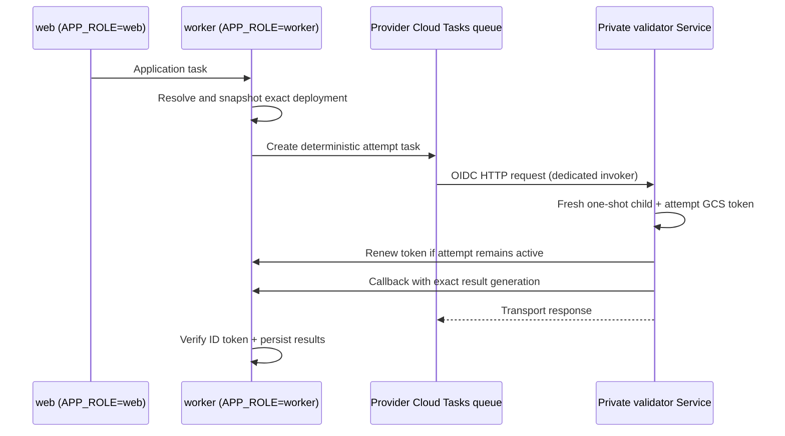
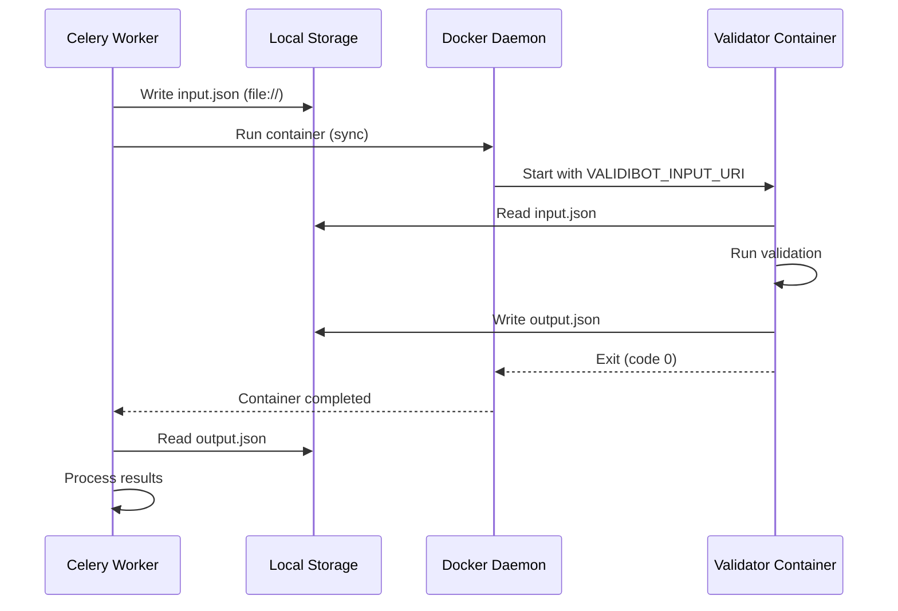

# Validator Containers (Advanced Validators)

Validator containers run advanced validations such as EnergyPlus, FMU,
SHACL, and Schematron. They support two deployment modes:

1. **GCP managed execution**: Cloud Run Services are the normal route, with
   retained Cloud Run Jobs for work over the Service budget and rollback
2. **Docker Compose** (Docker): Sync execution with local filesystem storage

## GCP mode: provider-selectable Services and Jobs

We deploy one Django image as two Cloud Run services:

- **$GCP_APP_NAME-web** (`APP_ROLE=web`): Public UI + public API.
- **$GCP_APP_NAME-worker** (`APP_ROLE=worker`): Private/IAM-only internal API (callbacks).

Every advanced attempt snapshots one verified `ValidatorExecutionDeployment`.
Attempts with an effective domain budget of at most 1500 seconds use the ready
primary Cloud Run Service. Longer attempts use the retained Cloud Run Job.
Both runtimes call the worker using Google-signed ID tokens and the attempt
callback nonce. There is no shared callback secret.

In environments with a custom public domain (production), `SITE_URL` points at the public domain (for example `https://validibot.com`) while `WORKER_URL` points at the worker service `*.run.app` URL. Callbacks and scheduled tasks should always target `WORKER_URL`, never `SITE_URL`.

## Flow overview


```mermaid
sequenceDiagram
    participant Web as web (APP_ROLE=web)
    participant Worker as worker (APP_ROLE=worker)
    participant Queue as Provider Cloud Tasks queue
    participant Service as Private validator Service

    Web->>Worker: Application task
    Worker->>Worker: Resolve and snapshot exact deployment
    Worker->>Queue: Create deterministic attempt task
    Queue->>Service: OIDC HTTP request (dedicated invoker)
    Service->>Service: Fresh one-shot child + attempt GCS token
    Service->>Worker: Renew token if attempt remains active
    Service->>Worker: Callback with exact result generation
    Service-->>Queue: Transport response
    Worker->>Worker: Verify ID token + persist results
```

IAM roles involved:

- **Web/Worker service account** (`$GCP_APP_NAME-cloudrun-{stage}`): Custom `validibot_job_runner` role (the historical ID now represents the validator controller) so Django can read exact Job/Service configuration, verify Service invoker IAM, and call the Jobs API with overrides for `VALIDIBOT_INPUT_URI`.
- **Validator runtime service account** (`$GCP_APP_NAME-validator-{stage}`): Used by both Services and Jobs. It has `roles/run.invoker` on the worker for callbacks and renewal, but **no project or bucket storage role**. Django supplies a short-lived Credential Access Boundary token limited to one attempt prefix and the `roles/storage.objectViewer` + `roles/storage.objectCreator` permission ceiling.
- **Provider-task invoker** (`$GCP_APP_NAME-val-invoker-{stage}`): Has no project roles. It is the only `roles/run.invoker` member on the four private validator Services and is attached only to provider-queue tasks. The abbreviated resource name stays within Google's 30-character service-account ID limit for `prod`, `staging`, and `dev`.
- **Worker**: private, only allows authenticated calls; rejects callbacks on web.

Cloud Run Jobs remain a separate execution shape. They have queryable provider
status and may run for up to their configured long-running budget. Cloud Run
Services have no durable per-request status resource, so callback/output
reconciliation is authoritative and their transport task is deterministic.

### Custom IAM Role

The standard `roles/run.invoker` role only includes `run.jobs.run`, but
triggering Jobs with environment variable overrides (like
`VALIDIBOT_INPUT_URI`) requires `run.jobs.runWithOverrides`. Deployment import
and hourly drift verification must also read each exact Job or Service and the
Service invoker policy before trusting it. We use a narrow project-level custom
role rather than the much broader `roles/run.viewer`:

```bash
# Role: projects/$GCP_PROJECT_ID/roles/validibot_job_runner
# Permissions:
#   run.jobs.get
#   run.jobs.run
#   run.jobs.runWithOverrides
#   run.services.get
#   run.services.getIamPolicy
```

The role ID is retained for compatibility. `just gcp init-stage` reconciles the
role and its project-level binding; `just gcp validator-job-deploy` also retains a
resource-level binding on each Job. The role cannot list unrelated resources,
change a Service, or change IAM.

Why env + GCS pointer: Cloud Run Jobs only accept per-run overrides via env/command; we keep large envelopes in GCS and pass the input URI plus its short-lived attempt token as execution overrides. Cloud Run documents that environment values are visible to project viewers, so treat execution-view permission as privileged. The token is still bounded to one attempt and a short lifetime, is never logged or persisted by Validibot, and cannot delete or replace an existing object.

Status tracking: We record the Cloud Run execution name and a `job_status` using `CloudRunJobStatus` (PENDING/RUNNING/SUCCEEDED/FAILED/CANCELLED) in launch stats for observability and fallback polling; run/step lifecycle still uses `ValidationRunStatus`/`StepStatus`.

## Why we use a callback_id in addition to run_id

Cloud Run retries callbacks if delivery fails. The run ID tells us which resource to update, but it does not distinguish one delivery attempt from another. Without a per-callback token we would reapply findings and status every time the platform retries, or we would have to drop all later callbacks for that run.

The launcher generates a unique `callback_id` for each job execution and puts it into the input envelope. The validator echoes it back in the callback. The worker uses that ID to fence retries: the first delivery creates a receipt; any repeat with the same `callback_id` returns immediately as a replay. This lets us ignore duplicate deliveries while still accepting legitimate future callbacks for the same run (for example, another step or a rerun).

## Deployment steps

1. Build/push Django image (same for web/worker)
2. Deploy web:
   - `--allow-unauthenticated`
   - `--set-env-vars APP_ROLE=web`
3. Deploy worker:
   - `--no-allow-unauthenticated`
   - `--set-env-vars APP_ROLE=worker`
   - Set `WORKER_URL` in the stage env file to the worker service URL (see below)
   - Grant `roles/run.invoker` on `$GCP_APP_NAME-worker` to each validator job service account

4. Validator deployments:
   - Deploy Jobs and release-specific Services by digest
   - Keep Service concurrency at one and use a distinct provider queue
   - Register live ready revisions before activation; never route from a raw URL setting
   - Tag provider resources with validator, release, stage, and execution shape
   - Backend images carry OCI labels such as `org.opencontainers.image.version` and `org.opencontainers.image.revision`
   - Callback client mints an ID token via metadata server; Django callback view 404s on non-worker.
   - Validator SA has no ambient GCS role; token renewal requires the attempt callback nonce and an active durable attempt.

To populate `WORKER_URL` for a stage, fetch the worker service URL and add it to the stage env file:

```bash
# prod example
gcloud run services describe $GCP_APP_NAME-worker \
  --region $GCP_REGION \
  --project $GCP_PROJECT_ID \
  --format='value(status.url)'
```

Then update your env file (`.envs/.production/.google-cloud/.django`), run `just gcp secrets prod`, and redeploy.

## Deploying validator backends

Development may build directly from the backend checkout. Production accepts
only a signed `vX.Y.Z` backend release whose GHCR attestation and GAR mirror
resolve to the same digest.

### Development

```bash
just gcp validator-deploy-all dev v0.15.0
just gcp validator-deployments-sync dev
just gcp validator-services-register dev
```

For a source-checkout-only Job or Service diagnostic, use the explicit
`validator-job-deploy` or `validator-service-deploy` command. Routine staging
uses `validator-deploy` / `validator-deploy-all` so both execution shapes come
from one release.

### Production release deployment

```bash
just gcp validator-deploy-all prod v0.15.0
```

The complete deploy command verifies and mirrors the signed release, then
deploys all four Jobs and all four release-specific Services without
registering or activating them. With production already in maintenance mode,
run the immutable-I/O, smoke, burst, latency, and route-rollback acceptance as
one operation:

```bash
just gcp validator-acceptance prod v0.15.0
```

Validator GCS capabilities are unconditional and stage IAM must already deny
the runtime identity ambient object access. A successful command leaves
Services primary but keeps the whole application offline. A failure restores
the capability-aware Job route without re-granting storage access. Forced
duplicate delivery, deadline, callback-loss salvage, and rollback during an
in-flight request remain the separate failure-mode acceptance exercises in the
internal rollout record.

The internal mirror step verifies the signed tag and GHCR attestation before
copying by digest into GAR; it does not rebuild. Deployment then proves the two
registries contain byte-identical release images.

### What the complete deploy command does

1. **Verifies and mirrors** the explicit signed release, resolving every image
   to the same immutable digest in GHCR and GAR. Development checkout builds
   remain available only through the low-level Job/Service commands.
2. **Deploys** the retained Cloud Run Job with:
   - Stage-appropriate job name (`$GCP_APP_NAME-validator-backend-energyplus-dev` for dev, `$GCP_APP_NAME-validator-backend-energyplus` for prod). The same name the runtime resolves at dispatch time via `ValidatorConfig.cloud_run_job_name`.
   - Dedicated validator service account (`$GCP_APP_NAME-validator-dev@...` for dev) with no ambient storage role
   - Memory (4Gi), CPU (2), timeout (1 hour), no retries
   - Labels for tracking (`validator=energyplus,stage=dev,version=abc123`)
3. **Deploys** a separate private Service per backend release with concurrency
   one, Startup CPU Boost, service-level min/max capacity, and the shared HTTP
   parent entrypoint
4. **Reconciles IAM permissions**:
   - Adds custom `validibot_job_runner` role to the main SA so the web/worker service can trigger the job with env overrides
   - Grants `roles/run.invoker` on the worker to the validator runtime SA
   - Removes every validator Service invoker except the dedicated provider-task identity
5. Leaves application routing unchanged. `validator-acceptance` performs
   registration and activation only after observing the exact ready revision,
   digest, runtime identity, invoker policy, resources, timeout, concurrency,
   and capacity.

### Viewing logs and job status

```bash
# From validibot_validators directory
just list-jobs                      # List all validator jobs
just describe-job energyplus dev    # Show job details
just logs energyplus dev            # View recent logs

# From validibot directory (equivalent)
gcloud run jobs list --filter "name~$GCP_APP_NAME-validator" --region $GCP_REGION
```

## Multi-Environment Architecture

Validator containers are **stage-agnostic**: the same container image is deployed to dev, staging, and prod. All stage-specific configuration is passed at runtime, not build time.

### What's baked into the container (build time)

Nothing stage-specific. The container includes:

- EnergyPlus binary (or FMU runtime)
- Python dependencies
- Validator code

### What's passed at runtime (attempt execution)

When Django triggers a validator Cloud Run Job execution, it passes:

| Source                        | Data                             | Example                                                                     |
| ----------------------------- | -------------------------------- | --------------------------------------------------------------------------- |
| `VALIDIBOT_INPUT_URI` env var | GCS path to input envelope       | `gs://$GCP_APP_NAME-storage-dev/runs/org/run/attempts/attempt/input.json`             |
| Capability env overrides | Short-lived token, expiry, allowed attempt prefix, refresh URL | Values are generated per execution and must never be logged |
| Input envelope                | `context.callback_url`           | `https://$GCP_APP_NAME-worker-dev-xxx.run.app/api/v1/validation-callbacks/` |
| Input envelope                | `context.execution_bundle_uri`   | `gs://$GCP_APP_NAME-storage-dev/private/runs/run456/`                       |
| Input envelope                | Input file URIs (IDF, EPW, etc.) | `gs://$GCP_APP_NAME-storage-dev/private/runs/run456/model.idf`              |

Before launch, Django copies exact generations of any reusable resource or upstream artifact into the attempt prefix. The validator then reads the input envelope, verifies those files while streaming, creates outputs below the same prefix, and POSTs results to the callback URL. If the first token expires, the backend presents the callback nonce to the worker; terminal attempts cannot renew.

### Stage isolation

Stage isolation is enforced by:

1. **Django** creates envelopes with stage-appropriate bucket names and callback URLs
2. **Service accounts** - each stage has separate application, validator-runtime,
   and provider-invoker identities
3. **GCS capabilities** - the Django identity can access its stage bucket; the
   validator identity cannot. Its injected token is limited to one
   stage-bucket attempt prefix.

## Mandatory attempt-capability contract

GCS + Cloud Run has one supported execution contract. Token delivery cannot be
disabled, and the validator runtime identity cannot retain ambient object
access. Deploy Django and the backend release together while the stage is
offline; mixed capability-aware and legacy images are not supported:

1. Deploy a published capability-aware `validibot-validator-backends` release
   and the matching Django code. For the July 2026 Service rollout baseline:

   ```bash
   cd /Users/danielmcquillen/projects/validibot/validibot
   just gcp validator-deploy-all prod v0.15.1
   ```

2. Reconcile stage IAM and deploy the matching Django release in maintenance
   mode. Stage provisioning removes historical validator storage roles; Django
   always stages attempt inputs and delivers a bounded token:

   ```bash
   cd /Users/danielmcquillen/projects/validibot/validibot
   just gcp init-stage prod
   just gcp deploy-maintenance prod
   ```

3. Run the one acceptance operation while the stage remains offline:

   ```bash
   cd /Users/danielmcquillen/projects/validibot/validibot
   just gcp validator-acceptance prod v0.15.1
   ```

   This command removes any known historical ambient IAM, requires Policy
   Troubleshooter denial, probes allowed and forbidden downscoped-token
   operations, runs the four artifact-producing canaries and 20-attempt bursts,
   and retains private JSON. Failure restores the capability-aware Job route
   but never restores ambient storage access. No configuration finalization is
   required after success.

### Deploy-time environment variables

The only env vars set at deploy time are for routing/log filtering:

```bash
VALIDIBOT_STAGE=dev           # For log filtering (doesn't affect behavior)
```

Validator backend version is not a runtime env var. Inspect the image's OCI labels
(`org.opencontainers.image.version`, `org.opencontainers.image.revision`) for
operator-readable release metadata. The evidence manifest records the resolved
image digest as the trust-critical backend identity.

### Implications

- **One release, deploy everywhere**: Production stages resolve the same
  attested backend digest
- **No ambient data credential**: The attached runtime identity can mint a
  callback token but cannot read GCS objects; the injected attempt capability
  is the data boundary
- **Safe rollbacks**: New attempts return to retained Jobs while in-flight
  Service attempts keep their exact deployment snapshot
- **Pre-contact block enforcement**: A pinned but still-pending Service attempt
  is locked and rechecked immediately before dispatch. An emergency block or
  loss of readiness stops provider contact without silently choosing another
  backend
- **Snapshot-authoritative dispatch**: The provider task uses the attempt's
  immutable route, revision, audience, image digest, and execution limits. A
  conflicting live deployment row fails closed

## Image-pinning policy: `VALIDATOR_BACKEND_IMAGE_POLICY`

Every deployment target may select `tag`, `digest`, or `signed-digest`.
Production GCP selects `digest` in its environment and its release tooling
separately verifies the signed release, resolves an attested matching GHCR/GAR
digest, and deploys the provider resource by that digest.

### The three policies

| Setting value     | What it accepts                                          | Use case                                            |
| ----------------- | -------------------------------------------------------- | --------------------------------------------------- |
| `tag`             | Anything (tag, digest, latest)                           | Default for community / self-host quick-start       |
| `digest`          | Image references containing `@sha256:<hex>`              | Production self-hosted: prove which bytes ran       |
| `signed-digest`   | Digest-pinned **and** cosign verification enabled        | High-trust environments                             |

The policy is enforced by `validibot/validations/services/image_policy.py`. Every Cloud Run launcher path (`launcher.py`) consults `enforce_image_policy()` before triggering the job and refuses to launch when the configured image violates the policy.

### Resolution rules

The setting resolver applies three rules:

1. **Empty or unset** → defaults to `tag`. The bootstrap-friendly default for community installs that haven't been hardened yet.
2. **Recognised value** (case-insensitive) → that policy.
3. **Non-empty unrecognised value** → raises `ImproperlyConfigured`.

The third rule is the security-critical one. A typo in a strict-intent setting (`"strict"` instead of `"signed-digest"`, `"hash"` instead of `"digest"`, …) used to silently fall back to `tag`. That inverted operator intent and turned the loosest mode into the effective policy. The resolver now fails loud so the bug surfaces immediately. The doctor command (`validibot doctor`) catches the exception and reports it as a `VB711` check failure rather than crashing the whole run.

### Strict-mode lookup failures

Under `digest` and `signed-digest` policies, the launcher needs to read the
Cloud Run Job's *configured* image to validate it against the policy. If that
lookup fails (the Job doesn't exist, the service account lacks
`run.jobs.get`, or the project ID is wrong), the launcher cannot verify the
image — and under strict intent that is a launch-blocking configuration error,
not a "let's hope for the best" fallback. The launcher refuses to trigger the
Job and surfaces a clear error message naming the missing prerequisite.

Under the default `tag` policy a lookup failure is non-fatal—the
launcher proceeds and execution metadata is captured best-effort.

### Doctor check

Run `validibot doctor` to get a stage-aware advisory:

- `VB711` (error) — invalid `VALIDATOR_BACKEND_IMAGE_POLICY` value (typo).
- `VB712` (warn / info) — policy is `tag` and the deployment target is `production`. Operators on production targets should pin to `digest` or `signed-digest`.
- `VB713` (error) — policy is `signed-digest` but `COSIGN_VERIFY_VALIDATOR_BACKEND_IMAGES` is false. Every launch will be refused; either enable cosign verification or relax the policy.


## Reconciliation and lost-callback recovery

If a callback never reaches Django, the durable attempt remains the authority.
The `cleanup_stuck_runs` management command handles both execution shapes:

1. The command runs every 10 minutes via Cloud Scheduler
2. It finds runs stuck in `RUNNING` past `VALIDATOR_TIMEOUT_SECONDS` (default:
   3600 seconds / 60 minutes)
3. It first tries to load and verify the exact expected output generation. A
   valid output is processed through the same trusted callback service
4. For Jobs, it may also query the provider execution status and cancel the
   execution after the absolute deadline
5. For Services, status lookup is explicitly unsupported. The watchdog retries
   transient output/provider errors only within a bounded grace period; the
   absolute attempt deadline still wins
6. Service cancellation deletes the deterministic provider task when possible
   and durably fences the attempt. A request already executing may finish, but
   its late output/callback cannot change the terminal decision
7. Each request child starts in a new operating-system session. A hard deadline
   terminates the complete process group, escalating from `SIGTERM` to
   `SIGKILL`, so domain-runner grandchildren cannot leak into the next request

### Where execution metadata is stored

Execution metadata is persisted on `ExecutionAttempt`, including the exact
`deployment`, immutable `deployment_snapshot`, provider task/execution identity,
deployment
revision, backend digest, deadlines, envelopes, and timing stages. Legacy Job
stats may also appear in `step_run.output`:

```python
stats = {
    "job_status": "PENDING",
    "job_name": "validibot-validator-backend-energyplus",
    "execution_name": "projects/p/locations/r/jobs/j/executions/e",
    "input_uri": "gs://bucket/runs/org/run-id/input.json",
    "execution_bundle_uri": "gs://bucket/runs/org/run-id",
}
```

New reconciliation uses the attempt record and exact output identity rather
than reconstructing authority from these legacy stats.

## Local vs cloud storage

- Cloud: GCS URIs for envelopes/artifacts.
- Local dev/test: file system paths under `MEDIA_ROOT` (no GCS required).

## Error handling

- Containers log all errors; fatal errors are optionally sent to Sentry if configured.
- User-facing messages stay minimal; detailed context stays in logs/Sentry.
- To inspect logs: filter Cloud Logging on `cloud_run_job` for retained Jobs or
  `cloud_run_revision` plus the release-specific validator Service name.
  Structured runtime logs include safe attempt/deployment/task identifiers and
  durations but never capability tokens or callback nonces. Fatal errors will include stack traces.
  If Sentry DSN is present in the container, `report_fatal` will forward the exception there.
  (Sentry bootstrap for validator containers is planned; for now, errors always land in Cloud Logging.)

## Docker Compose Mode: Docker Runner

For Docker Compose deployments (single-server, VPS, on-premise), validators run as Docker containers executed synchronously by the Celery worker.

### How it works


```mermaid
sequenceDiagram
    participant Worker as Celery Worker
    participant Storage as Local Storage
    participant Docker as Docker Daemon
    participant Container as Validator Container

    Worker->>Storage: Write input.json (file://)
    Worker->>Docker: Run container (sync)
    Docker->>Container: Start with VALIDIBOT_INPUT_URI
    Container->>Storage: Read input.json
    Container->>Container: Run validation
    Container->>Storage: Write output.json
    Container-->>Docker: Exit (code 0)
    Docker-->>Worker: Container completed
    Worker->>Storage: Read output.json
    Worker->>Worker: Process results
```

Key differences from GCP mode:

- **Synchronous execution**: Worker blocks until container exits
- **Local filesystem**: Uses `file://` URIs instead of `gs://`
- **No callbacks**: Results are read directly from storage after container exits
- **Docker socket**: Worker needs access to `/var/run/docker.sock`

### Configuration

Configure the Docker runner in Django settings:

```python
# In settings or environment
VALIDATOR_RUNNER = "docker"
VALIDATOR_RUNNER_OPTIONS = {
    "memory_limit": "4g",      # Container memory limit
    "cpu_limit": "2.0",        # CPU limit (cores)
    "network": "validibot",    # Docker network for container
    "timeout_seconds": 3600,   # Max execution time (1 hour)
}
```

For Docker Compose deployments, also configure storage volume sharing:

```python
# Storage volume (for Docker-in-Docker scenarios)
VALIDATOR_STORAGE_VOLUME = "validibot_local_storage"
VALIDATOR_STORAGE_MOUNT_PATH = "/app/storage"
DATA_STORAGE_ROOT = "/app/storage/private"
```

### Environment Variables

All runners pass these standardized environment variables to containers:

| Variable               | Description                                    |
| ---------------------- | ---------------------------------------------- |
| `VALIDIBOT_INPUT_URI`  | URI to input envelope (`file://` or `gs://`)   |
| `VALIDIBOT_OUTPUT_URI` | URI for output envelope (`file://` or `gs://`) |
| `VALIDIBOT_RUN_ID`     | Validation run ID (for logging and labeling)   |

### Building Containers for Docker Compose

```bash
# From validibot_validators directory
just build energyplus
just build fmu
just build-all

# Images are available locally as:
# validibot-validator-backend-energyplus:latest
# validibot-validator-backend-fmu:latest
# (same name as ValidatorConfig.image_name and cloud_run_job_name)
```

### Docker Compose Configuration

For local development with Docker Compose:

```yaml
# docker-compose.local.yml
volumes:
  validibot_local_storage: # Shared storage for validation files

services:
  django:
    volumes:
      # Docker socket for spawning validator containers
      - /var/run/docker.sock:/var/run/docker.sock
      # Shared storage volume
      - validibot_local_storage:/app/storage
    environment:
      - VALIDATOR_RUNNER=docker
      - VALIDATOR_NETWORK=validibot_validibot
      - VALIDATOR_STORAGE_VOLUME=validibot_validibot_local_storage
      - VALIDATOR_STORAGE_MOUNT_PATH=/app/storage
      - DATA_STORAGE_ROOT=/app/storage/private
```

### Validator Container Contract

Validator containers must support both storage backends:

1. **Accept input URI** via `VALIDIBOT_INPUT_URI` environment variable
2. **Support `file://` URIs** in addition to `gs://` URIs
3. **Write output** to the URI specified by `VALIDIBOT_OUTPUT_URI` or derived from execution bundle
4. **Skip callbacks** when `skip_callback` is set (sync mode doesn't need them)

See `validibot_validators/validators/core/storage_client.py` for the implementation that handles both URI schemes.

### Advanced Validator Management

Enable advanced validators by listing container images in settings:

```bash
# Environment variable
ADVANCED_VALIDATOR_IMAGES=ghcr.io/validibot/energyplus:24.2.0,ghcr.io/validibot/fmu:0.9.0
```

Then sync validators from container metadata:

```bash
# Sync from configured images (reads metadata from Docker labels)
python manage.py sync_validators

# Preview without creating (dry run)
python manage.py sync_validators --dry-run

# Sync specific image (ignores ADVANCED_VALIDATOR_IMAGES)
python manage.py sync_validators --image ghcr.io/validibot/energyplus:24.2.0

# Skip pulling images (if already present locally)
python manage.py sync_validators --no-pull
```

The command reads metadata from Docker labels (`org.validibot.validator.metadata`) and creates/updates Validator records. Validators removed from the settings are soft-deleted (set to DRAFT state).

### Container Cleanup (Ryuk Pattern)

The Docker runner labels all spawned containers for robust cleanup:

| Label                           | Purpose                         |
| ------------------------------- | ------------------------------- |
| `org.validibot.managed`         | Identifies Validibot containers |
| `org.validibot.run_id`          | Validation run ID               |
| `org.validibot.validator`       | Validator slug                  |
| `org.validibot.started_at`      | ISO timestamp                   |
| `org.validibot.timeout_seconds` | Configured timeout              |

Cleanup strategies:

1. **On-demand** - Container removed after each run (normal path)
2. **Periodic sweep** - Background task cleans up orphaned containers every 10 minutes
3. **Startup cleanup** - Worker removes leftover containers on startup

Manual cleanup:

```bash
# Show what would be cleaned up
python manage.py cleanup_containers --dry-run

# Remove orphaned containers
python manage.py cleanup_containers

# Remove ALL managed containers
python manage.py cleanup_containers --all
```
