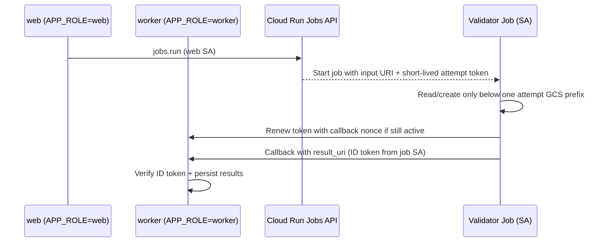
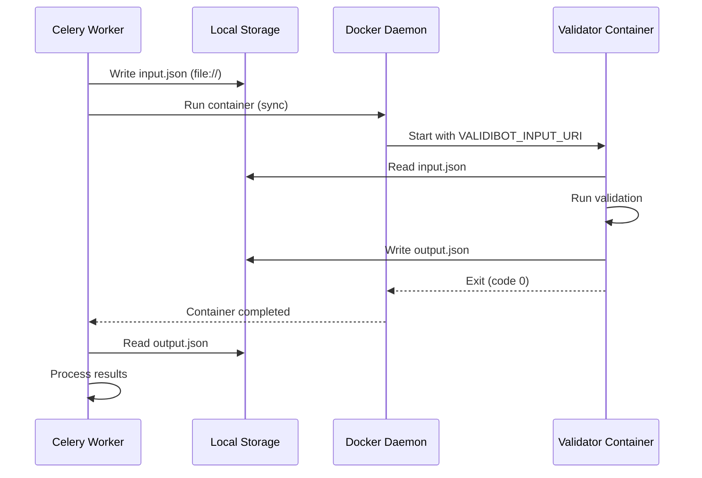

# Validator Containers (Advanced Validators)

Validator containers run advanced validations like EnergyPlus simulations and FMU execution. They support two deployment modes:

1. **GCP Cloud Run Jobs** (production): Async execution with GCS storage and callbacks
2. **Docker Compose** (Docker): Sync execution with local filesystem storage

## GCP Mode: Cloud Run Jobs (web/worker split)

We deploy one Django image as two Cloud Run services:

- **$GCP_APP_NAME-web** (`APP_ROLE=web`): Public UI + public API.
- **$GCP_APP_NAME-worker** (`APP_ROLE=worker`): Private/IAM-only internal API (callbacks).

Validator jobs (EnergyPlus, FMU, etc.) run as Cloud Run Jobs and call back to the worker service using Google-signed ID tokens (audience = callback URL). No shared secrets.

In environments with a custom public domain (production), `SITE_URL` points at the public domain (for example `https://validibot.com`) while `WORKER_URL` points at the worker service `*.run.app` URL. Callbacks and scheduled tasks should always target `WORKER_URL`, never `SITE_URL`.

## Flow overview


```mermaid
sequenceDiagram
    participant Web as web (APP_ROLE=web)
    participant Worker as worker (APP_ROLE=worker)
    participant JobsAPI as Cloud Run Jobs API
    participant Job as Validator Job (SA)

    Web->>JobsAPI: jobs.run (web SA)
    JobsAPI-->>Job: Start job with input URI + short-lived attempt token
    Job->>Job: Read/create only below one attempt GCS prefix
    Job->>Worker: Renew token with callback nonce if still active
    Job->>Worker: Callback with result_uri (ID token from job SA)
    Worker->>Worker: Verify ID token + persist results
```

IAM roles involved:

- **Web/Worker service account** (`$GCP_APP_NAME-cloudrun-{stage}`): Custom `validibot_job_runner` role on the validator job so Django can call the Jobs API with overrides (for `VALIDIBOT_INPUT_URI` env var). This role includes `run.jobs.run` and `run.jobs.runWithOverrides` permissions.
- **Validator job service account** (`$GCP_APP_NAME-validator-{stage}`): Dedicated runtime SA used by validator Cloud Run Jobs. It has `roles/run.invoker` on `$GCP_APP_NAME-worker` for callbacks and token renewal, but **no project or bucket storage role**. Django supplies a short-lived Credential Access Boundary token limited to one attempt prefix and the `roles/storage.objectViewer` + `roles/storage.objectCreator` permission ceiling.
- **Worker**: private, only allows authenticated calls; rejects callbacks on web.

### Custom IAM Role

The standard `roles/run.invoker` role only includes `run.jobs.run`, but triggering jobs with environment variable overrides (like `VALIDIBOT_INPUT_URI`) requires `run.jobs.runWithOverrides`. We use a project-level custom role:

```bash
# Role: projects/$GCP_PROJECT_ID/roles/validibot_job_runner
# Permissions: run.jobs.run, run.jobs.runWithOverrides
```

This role is automatically granted by the `just gcp validator-deploy` command.

Why env + GCS pointer: Cloud Run Jobs only accept per-run overrides via env/command; we keep large envelopes in GCS and pass the input URI plus its short-lived attempt token as execution overrides. Cloud Run documents that environment values are visible to project viewers, so treat execution-view permission as privileged. The token is still bounded to one attempt and a short lifetime, is never logged or persisted by Validibot, and cannot delete or replace an existing object.

Status tracking: We record the Cloud Run execution name and a `job_status` using `CloudRunJobStatus` (PENDING/RUNNING/SUCCEEDED/FAILED/CANCELLED) in launch stats for observability and fallback polling; run/step lifecycle still uses `ValidationRunStatus`/`StepStatus`.

## Why we use a callback_id in addition to run_id

Cloud Run retries callbacks if delivery fails. The run ID tells us which resource to update, but it does not distinguish one delivery attempt from another. Without a per-callback token we would reapply findings and status every time the platform retries, or we would have to drop all later callbacks for that run.

The launcher generates a unique `callback_id` for each job execution and puts it into the input envelope. The validator echoes it back in the callback. The worker uses that ID to fence retries: the first delivery creates a receipt; any repeat with the same `callback_id` returns immediately as a replay. This lets us ignore duplicate deliveries while still accepting legitimate future callbacks for the same run (for example, another step or a rerun).

## Deployment steps

1. Build/push Django image (same for web/worker)
2. Deploy web:
   - `--allow-unauthenticated`
   - `--set-env-vars APP_ROLE=web`
3. Deploy worker:
   - `--no-allow-unauthenticated`
   - `--set-env-vars APP_ROLE=worker`
   - Set `WORKER_URL` in the stage env file to the worker service URL (see below)
   - Grant `roles/run.invoker` on `$GCP_APP_NAME-worker` to each validator job service account

4. Validator jobs:
   - Tag Cloud Run Jobs with labels: `validator=<name>,revision=<backend_git_sha>`
   - Backend images carry OCI labels such as `org.opencontainers.image.version` and `org.opencontainers.image.revision`
   - Callback client mints an ID token via metadata server; Django callback view 404s on non-worker.
   - Validator SA has no ambient GCS role; token renewal requires the attempt callback nonce and an active durable attempt.

To populate `WORKER_URL` for a stage, fetch the worker service URL and add it to the stage env file:

```bash
# prod example
gcloud run services describe $GCP_APP_NAME-worker \
  --region $GCP_REGION \
  --project $GCP_PROJECT_ID \
  --format='value(status.url)'
```

Then update your env file (`.envs/.production/.google-cloud/.django`), run `just gcp secrets prod`, and redeploy.

## Deploying Validator Jobs

Validator containers can be deployed using either justfile. Both are equivalent and kept in sync:

| Location                | Command                                    | Notes                                       |
| ----------------------- | ------------------------------------------ | ------------------------------------------- |
| `validibot/`            | `just gcp validator-deploy energyplus dev` | Uses symlink to `validibot_validators_dev/` |
| `validibot_validators/` | `just deploy energyplus dev`               | Native repo, shorter command                |

### Quick deploy

```bash
# From validibot_validators directory
just deploy energyplus dev      # Deploy EnergyPlus to dev
just deploy fmu prod            # Deploy FMU to prod
just deploy-all dev             # Deploy all validators to dev

# From validibot directory
just gcp validator-deploy energyplus dev
just gcp validators-deploy-all dev
```

### What the deploy command does

1. **Builds** the container image with `linux/amd64` platform (required by Cloud Run)
2. **Pushes** to Artifact Registry at `$GCP_REGION-docker.pkg.dev/project-xxx/validibot/`
3. **Deploys** the Cloud Run Job with:
   - Stage-appropriate job name (`$GCP_APP_NAME-validator-backend-energyplus-dev` for dev, `$GCP_APP_NAME-validator-backend-energyplus` for prod). The same name the runtime resolves at dispatch time via `ValidatorConfig.cloud_run_job_name`.
   - Dedicated validator service account (`$GCP_APP_NAME-validator-dev@...` for dev) with no ambient storage role
   - Memory (4Gi), CPU (2), timeout (1 hour), no retries
   - Labels for tracking (`validator=energyplus,stage=dev,version=abc123`)
4. **Grants IAM permissions**:
   - Adds custom `validibot_job_runner` role to the main SA so the web/worker service can trigger the job with env overrides
   - Grants `roles/run.invoker` on the worker service to the validator SA so the job can POST callbacks and renew an active attempt token

### Viewing logs and job status

```bash
# From validibot_validators directory
just list-jobs                      # List all validator jobs
just describe-job energyplus dev    # Show job details
just logs energyplus dev            # View recent logs

# From validibot directory (equivalent)
gcloud run jobs list --filter "name~$GCP_APP_NAME-validator" --region $GCP_REGION
```

### Deleting a validator job

```bash
just delete-job energyplus dev
```

## Multi-Environment Architecture

Validator containers are **stage-agnostic**: the same container image is deployed to dev, staging, and prod. All stage-specific configuration is passed at runtime, not build time.

### What's baked into the container (build time)

Nothing stage-specific. The container includes:

- EnergyPlus binary (or FMU runtime)
- Python dependencies
- Validator code

### What's passed at runtime (job execution)

When Django triggers a validator Cloud Run Job execution, it passes:

| Source                        | Data                             | Example                                                                     |
| ----------------------------- | -------------------------------- | --------------------------------------------------------------------------- |
| `VALIDIBOT_INPUT_URI` env var | GCS path to input envelope       | `gs://$GCP_APP_NAME-storage-dev/runs/org/run/attempts/attempt/input.json`             |
| Capability env overrides | Short-lived token, expiry, allowed attempt prefix, refresh URL | Values are generated per execution and must never be logged |
| Input envelope                | `context.callback_url`           | `https://$GCP_APP_NAME-worker-dev-xxx.run.app/api/v1/validation-callbacks/` |
| Input envelope                | `context.execution_bundle_uri`   | `gs://$GCP_APP_NAME-storage-dev/private/runs/run456/`                       |
| Input envelope                | Input file URIs (IDF, EPW, etc.) | `gs://$GCP_APP_NAME-storage-dev/private/runs/run456/model.idf`              |

Before launch, Django copies exact generations of any reusable resource or upstream artifact into the attempt prefix. The validator then reads the input envelope, verifies those files while streaming, creates outputs below the same prefix, and POSTs results to the callback URL. If the first token expires, the backend presents the callback nonce to the worker; terminal attempts cannot renew.

### Stage isolation

Stage isolation is enforced by:

1. **Django** creates envelopes with stage-appropriate bucket names and callback URLs
2. **Service accounts** - each stage's validator job uses a stage-specific SA that only has access to its own buckets
3. **GCS bucket permissions** - the Django service identity can access its stage bucket; the validator identity cannot. Its injected token is limited to one stage-bucket attempt prefix.

## Attempt-capability rollout

Roll out in dependency order so old containers are never stranded without their
historical storage identity:

1. Publish and deploy capability-aware validator backend images.
2. Deploy Django with `GCS_VALIDATOR_ATTEMPT_CAPABILITIES_ENABLED=true` and
   `GCS_VALIDATOR_RUNTIME_IDENTITY_STORAGE_ACCESS_DISABLED=false`. Doctor
   remains WARN because container code could still fall back to ambient IAM.
3. Remove and verify the validator SA's direct predefined storage bindings:

   ```bash
   cd /Users/danielmcquillen/projects/validibot/validibot
   just gcp validator-storage-isolation prod
   ```

4. Run the provider negative probes and confirm the metadata identity cannot
   read, list, create, overwrite, or delete stage-bucket objects. This separate
   check is required because static `roles/storage*` inspection does not prove
   the absence of inherited, group, primitive, or custom-role permissions.
5. Set `GCS_VALIDATOR_RUNTIME_IDENTITY_STORAGE_ACCESS_DISABLED=true`, sync the
   stage secret, redeploy Django, and run doctor. `VB205` becomes OK only when
   both flags are true.

### Deploy-time environment variables

The only env vars set at deploy time are for routing/log filtering:

```bash
VALIDIBOT_STAGE=dev           # For log filtering (doesn't affect behavior)
```

Validator backend version is not a runtime env var. Inspect the image's OCI labels
(`org.opencontainers.image.version`, `org.opencontainers.image.revision`) for
operator-readable release metadata. The evidence manifest records the resolved
image digest as the trust-critical backend identity.

### Implications

- **One build, deploy everywhere**: Build once with `just validator-build energyplus`, then deploy to any stage
- **No secrets in containers**: Validators use ADC (Application Default Credentials) from the attached service account
- **Safe rollbacks**: Rolling back a validator version doesn't affect stage isolation

## Image-pinning policy: `VALIDATOR_BACKEND_IMAGE_POLICY`

Cloud Run Jobs let an operator deploy a validator backend by pointing the Job at any container image — `:latest`, a moving tag, a specific version, or a digest. The setting `VALIDATOR_BACKEND_IMAGE_POLICY` decides how strict Validibot is about what counts as an acceptable launch image.

### The three policies

| Setting value     | What it accepts                                          | Use case                                            |
| ----------------- | -------------------------------------------------------- | --------------------------------------------------- |
| `tag`             | Anything (tag, digest, latest)                           | Default for community / self-host quick-start       |
| `digest`          | Image references containing `@sha256:<hex>`              | Production self-hosted: prove which bytes ran       |
| `signed-digest`   | Digest-pinned **and** cosign verification enabled        | High-trust hosted environments                      |

The policy is enforced by `validibot/validations/services/image_policy.py`. Every Cloud Run launcher path (`launcher.py`) consults `enforce_image_policy()` before triggering the job and refuses to launch when the configured image violates the policy.

### Resolution rules

The setting resolver applies three rules:

1. **Empty or unset** → defaults to `tag`. The bootstrap-friendly default for community installs that haven't been hardened yet.
2. **Recognised value** (case-insensitive) → that policy.
3. **Non-empty unrecognised value** → raises `ImproperlyConfigured`.

The third rule is the security-critical one. A typo in a strict-intent setting (`"strict"` instead of `"signed-digest"`, `"hash"` instead of `"digest"`, …) used to silently fall back to `tag`. That inverted operator intent and turned the loosest mode into the effective policy. The resolver now fails loud so the bug surfaces immediately. The doctor command (`validibot doctor`) catches the exception and reports it as a `VB711` check failure rather than crashing the whole run.

### Strict-mode lookup failures

Under `digest` and `signed-digest` policies, the launcher needs to read the Cloud Run Job's *configured* image to validate it against the policy. If that lookup fails (the Job doesn't exist, the service account lacks `run.viewer`, the project ID is wrong), the launcher cannot verify the image — and under strict intent that is a launch-blocking configuration error, not a "let's hope for the best" fallback. The launcher refuses to trigger the Job and surfaces a clear error message naming the missing prerequisite.

Under the default `tag` policy a lookup failure is non-fatal — the launcher proceeds and execution metadata is captured best-effort.

### Doctor check

Run `validibot doctor` to get a stage-aware advisory:

- `VB711` (error) — invalid `VALIDATOR_BACKEND_IMAGE_POLICY` value (typo).
- `VB712` (warn / info) — policy is `tag` and the deployment target is `production`. Operators on production targets should pin to `digest` or `signed-digest`.
- `VB713` (error) — policy is `signed-digest` but `COSIGN_VERIFY_VALIDATOR_BACKEND_IMAGES` is false. Every launch will be refused; either enable cosign verification or relax the policy.

## Lost Callback Recovery

If a Cloud Run Job completes but its callback never reaches Django (network failure, container crash before POST, Cloud Run retry exhaustion), the run gets stuck in `RUNNING` status. The `cleanup_stuck_runs` management command handles this:

1. The command runs every 10 minutes via Cloud Scheduler
2. It finds runs stuck in `RUNNING` past `VALIDATOR_TIMEOUT_SECONDS` (default:
   3600 seconds / 60 minutes)
3. For GCP runs, it looks for `execution_name` in `step_run.output` (stored by the launcher at job trigger time)
4. It queries the Cloud Run Jobs API to check the actual execution status
5. If the job **succeeded**, it constructs a synthetic callback and processes it through `ValidationCallbackService`, recovering the full validation results
6. If the job **failed**, it marks the run as `FAILED` with the Cloud Run error
7. If the job is **still running after that outer deadline**, it commits the
   `TIMED_OUT` decision and calls Cloud Run's execution-cancellation operation

### Where execution metadata is stored

When the GCP backend triggers a Cloud Run Job, the launcher stores execution metadata in `result.stats`:

```python
stats = {
    "job_status": "PENDING",
    "job_name": "validibot-validator-backend-energyplus",
    "execution_name": "projects/p/locations/r/jobs/j/executions/e",
    "input_uri": "gs://bucket/runs/org/run-id/input.json",
    "execution_bundle_uri": "gs://bucket/runs/org/run-id",
}
```

The step orchestrator persists these stats into `step_run.output`, making them available for later reconciliation.

The output envelope URI is derived from `execution_bundle_uri + "/output.json"`.

## Local vs cloud storage

- Cloud: GCS URIs for envelopes/artifacts.
- Local dev/test: file system paths under `MEDIA_ROOT` (no GCS required).

## Error handling

- Containers log all errors; fatal errors are optionally sent to Sentry if configured.
- User-facing messages stay minimal; detailed context stays in logs/Sentry.
- To inspect logs: open Cloud Logging and filter on `resource.type="cloud_run_job"` and
  `resource.labels.job_name` matching the validator. Fatal errors will include stack traces.
  If Sentry DSN is present in the container, `report_fatal` will forward the exception there.
  (Sentry bootstrap for validator containers is planned; for now, errors always land in Cloud Logging.)

## Docker Compose Mode: Docker Runner

For Docker Compose deployments (single-server, VPS, on-premise), validators run as Docker containers executed synchronously by the Celery worker.

### How it works


```mermaid
sequenceDiagram
    participant Worker as Celery Worker
    participant Storage as Local Storage
    participant Docker as Docker Daemon
    participant Container as Validator Container

    Worker->>Storage: Write input.json (file://)
    Worker->>Docker: Run container (sync)
    Docker->>Container: Start with VALIDIBOT_INPUT_URI
    Container->>Storage: Read input.json
    Container->>Container: Run validation
    Container->>Storage: Write output.json
    Container-->>Docker: Exit (code 0)
    Docker-->>Worker: Container completed
    Worker->>Storage: Read output.json
    Worker->>Worker: Process results
```

Key differences from GCP mode:

- **Synchronous execution**: Worker blocks until container exits
- **Local filesystem**: Uses `file://` URIs instead of `gs://`
- **No callbacks**: Results are read directly from storage after container exits
- **Docker socket**: Worker needs access to `/var/run/docker.sock`

### Configuration

Configure the Docker runner in Django settings:

```python
# In settings or environment
VALIDATOR_RUNNER = "docker"
VALIDATOR_RUNNER_OPTIONS = {
    "memory_limit": "4g",      # Container memory limit
    "cpu_limit": "2.0",        # CPU limit (cores)
    "network": "validibot",    # Docker network for container
    "timeout_seconds": 3600,   # Max execution time (1 hour)
}
```

For Docker Compose deployments, also configure storage volume sharing:

```python
# Storage volume (for Docker-in-Docker scenarios)
VALIDATOR_STORAGE_VOLUME = "validibot_local_storage"
VALIDATOR_STORAGE_MOUNT_PATH = "/app/storage"
DATA_STORAGE_ROOT = "/app/storage/private"
```

### Environment Variables

All runners pass these standardized environment variables to containers:

| Variable               | Description                                    |
| ---------------------- | ---------------------------------------------- |
| `VALIDIBOT_INPUT_URI`  | URI to input envelope (`file://` or `gs://`)   |
| `VALIDIBOT_OUTPUT_URI` | URI for output envelope (`file://` or `gs://`) |
| `VALIDIBOT_RUN_ID`     | Validation run ID (for logging and labeling)   |

### Building Containers for Docker Compose

```bash
# From validibot_validators directory
just build energyplus
just build fmu
just build-all

# Images are available locally as:
# validibot-validator-backend-energyplus:latest
# validibot-validator-backend-fmu:latest
# (same name as ValidatorConfig.image_name and cloud_run_job_name)
```

### Docker Compose Configuration

For local development with Docker Compose:

```yaml
# docker-compose.local.yml
volumes:
  validibot_local_storage: # Shared storage for validation files

services:
  django:
    volumes:
      # Docker socket for spawning validator containers
      - /var/run/docker.sock:/var/run/docker.sock
      # Shared storage volume
      - validibot_local_storage:/app/storage
    environment:
      - VALIDATOR_RUNNER=docker
      - VALIDATOR_NETWORK=validibot_validibot
      - VALIDATOR_STORAGE_VOLUME=validibot_validibot_local_storage
      - VALIDATOR_STORAGE_MOUNT_PATH=/app/storage
      - DATA_STORAGE_ROOT=/app/storage/private
```

### Validator Container Contract

Validator containers must support both storage backends:

1. **Accept input URI** via `VALIDIBOT_INPUT_URI` environment variable
2. **Support `file://` URIs** in addition to `gs://` URIs
3. **Write output** to the URI specified by `VALIDIBOT_OUTPUT_URI` or derived from execution bundle
4. **Skip callbacks** when `skip_callback` is set (sync mode doesn't need them)

See `validibot_validators/validators/core/storage_client.py` for the implementation that handles both URI schemes.

### Advanced Validator Management

Enable advanced validators by listing container images in settings:

```bash
# Environment variable
ADVANCED_VALIDATOR_IMAGES=ghcr.io/validibot/energyplus:24.2.0,ghcr.io/validibot/fmu:0.9.0
```

Then sync validators from container metadata:

```bash
# Sync from configured images (reads metadata from Docker labels)
python manage.py sync_validators

# Preview without creating (dry run)
python manage.py sync_validators --dry-run

# Sync specific image (ignores ADVANCED_VALIDATOR_IMAGES)
python manage.py sync_validators --image ghcr.io/validibot/energyplus:24.2.0

# Skip pulling images (if already present locally)
python manage.py sync_validators --no-pull
```

The command reads metadata from Docker labels (`org.validibot.validator.metadata`) and creates/updates Validator records. Validators removed from the settings are soft-deleted (set to DRAFT state).

### Container Cleanup (Ryuk Pattern)

The Docker runner labels all spawned containers for robust cleanup:

| Label                           | Purpose                         |
| ------------------------------- | ------------------------------- |
| `org.validibot.managed`         | Identifies Validibot containers |
| `org.validibot.run_id`          | Validation run ID               |
| `org.validibot.validator`       | Validator slug                  |
| `org.validibot.started_at`      | ISO timestamp                   |
| `org.validibot.timeout_seconds` | Configured timeout              |

Cleanup strategies:

1. **On-demand** - Container removed after each run (normal path)
2. **Periodic sweep** - Background task cleans up orphaned containers every 10 minutes
3. **Startup cleanup** - Worker removes leftover containers on startup

Manual cleanup:

```bash
# Show what would be cleaned up
python manage.py cleanup_containers --dry-run

# Remove orphaned containers
python manage.py cleanup_containers

# Remove ALL managed containers
python manage.py cleanup_containers --all
```
